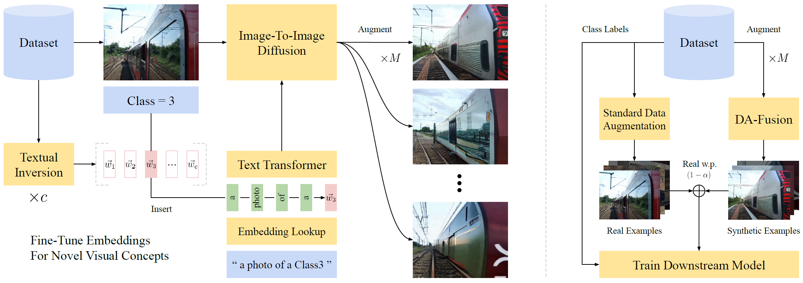

# Effective Data Augmentation With Diffusion Models



Existing data augmentations like rotations and re-colorizations provide diversity but preserve semantics. We explore how prompt-based generative models complement existing data augmentations by controlling image semantics via prompts. Our generative data augmentations build on Stable Diffusion and improve visual few-shot learning.
## Installation

To install the package, first create a `conda` environment.

```bash
conda create -n da-fusion python=3.7 pytorch==1.12.1 torchvision==0.13.1 cudatoolkit=11.6 -c pytorch
conda activate da-fusion
pip install diffusers["torch"] transformers pycocotools pandas matplotlib seaborn scipy
```

Then download and install the source code.

```bash
git clone git@github.com:anonymous-da-fusion/da-fusion.git
pip install -e da-fusion
```

## Datasets

We benchmark DA-Fusion on few-shot image classification problems, including a Leafy Spurge weed recognition task, and classification tasks derived from COCO and PASCAL VOC. For the latter two, we label images with the classes corresponding to the largest object in the image.

Custom datasets can be evaluated by implementing subclasses of `semantic_aug/few_shot_dataset.py`.

## Setting Up PASCAL VOC

Data for the PASCAL VOC task is adapted from the [2012 PASCAL VOC Challenge](http://host.robots.ox.ac.uk/pascal/VOC/voc2012/VOCtrainval_11-May-2012.tar). Once this dataset has been downloaded and extracted, the PASCAL dataset class `semantic_aug/datasets/pascal.py` should be pointed to the downloaded dataset via the `PASCAL_DIR` config variable located [here](https://github.com/anonymous-da-fusion/da-fusion/blob/main/semantic_aug/datasets/pascal.py#L14).

Ensure that `PASCAL_DIR` points to a folder containing `ImageSets`, `JPEGImages`, `SegmentationClass`, and `SegmentationObject` subfolders.

## Setting Up COCO

To setup COCO, first download the [2017 Training Images](http://images.cocodataset.org/zips/train2017.zip), the [2017 Validation Images](http://images.cocodataset.org/zips/val2017.zip), and the [2017 Train/Val Annotations](http://images.cocodataset.org/annotations/annotations_trainval2017.zip). These files should be unzipped into the following directory structure.

```
coco2017/
    train2017/
    val2017/
    annotations/
```

`COCO_DIR` located [here](https://github.com/anonymous-da-fusion/da-fusion/blob/main/semantic_aug/datasets/coco.py#L15) should be updated to point to the location of `coco2017` on your system.

## Setting Up The Spurge Dataset

We are planning to release this dataset in the next few months. Check back for updates!

## Fine-Tuning Tokens

We perform textual inversion (https://arxiv.org/abs/2208.01618) to adapt Stable Diffusion to the classes present in our few-shot datasets. The implementation in `fine_tune.py` is adapted from the [Diffusers](https://github.com/huggingface/diffusers/blob/main/examples/textual_inversion/textual_inversion.py) example. 
```
